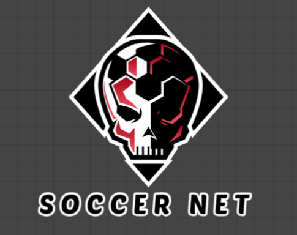
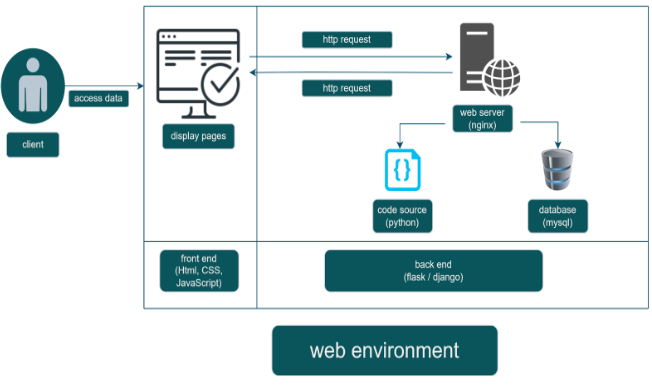
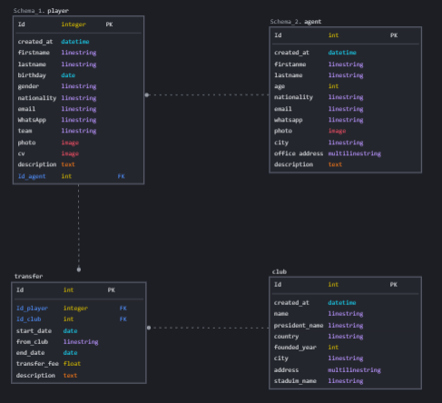
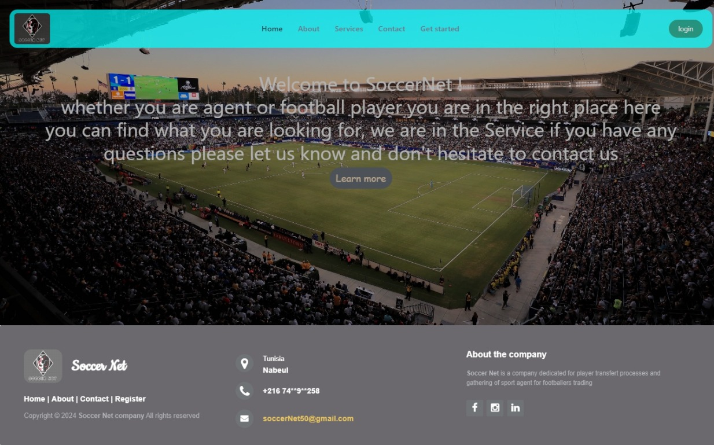

# SoccerNet portfolio

### *Description of the project* : 
*There is a lot of sport agents looking for football players for trading and sell them to appropriate teams whether they are amateur semi-pro or professional and traveling around the world for visiting a lot of teams also watching their matches for hunting Feasts such as pro football players to make a deals with some attractive category it can be exhausting and costly mission to earn a good income. Same as the soccer player who passed a respective career in his youth team and wants to change his experience to develop himself as a footballer to find his proper team and step by step for fame. same as a senior player who wants to start a new experience in another team. So our system came to fix those two problems. SoccerNet came To connect agents with football players together for communication and eventually arrive to deal Satisfy both parties.*

### *Team* : 
- **solo work**

### *programming languages used:*
- **Python**
- **html**
- **css**
- **javascript**

### *Technologies used*
- **Flask**
- **Mysqlalchemy orm**
- **bootstrap**

### *requirments*:
- **pip install Flask**
- **pip install SQLAlchemy**
- **pip install Flask-WTF**
- **pip install python-dotenv**
- **pip install datetime**
- **pip install bcrypt**

### *database managment system (DBMS)*:
- **mysql**

### *Architecture* :

### *database schema* :

### *Home Page Interface* :

### instructions :
- *set debug mode:*   
**$ export FLASK_DEBUG=1** 
- *runing flask app:*   
**$ flask run** 
- *make sure to start mysql before runing the flask app:*  
**$ sudo service mysql start**

### Features :
- Profile Management:
*Agents and players can create and manage their profiles.*
*Profiles include detailed information such as experience, achievements, and personal details.*

- Search and Matchmaking:
*Agents can search for players based on various criteria (skills, position, etc.).*
*Players can search for agents based on specialization and reputation.*

- Messaging and Communication:
*In-app messaging system to facilitate communication between agents and players.*
*Notifications for new messages, profile views, and match recommendations.*

- File Upload and Display:
*Players can upload images and PDFs (e.g., CVs, performance reports).*
*Files are stored in a static directory and can be viewed within the application.*

- Database Management:
*Use of SQLAlchemy for database interactions.*
*Secure storage and retrieval of user data.*

- Navigation and User Interface:
*Clean, intuitive UI built with Bootstrap.*
*Role-based navigation links to provide easy access to relevant sections.*

- Security:
*Password hashing using bcrypt for secure authentication.*
*Protection against common web vulnerabilities.*
